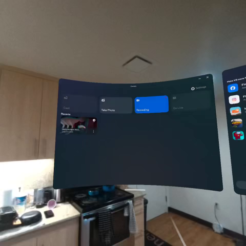

<h2 align="center">  Mixed Reality Design Interaction Using DeeDee </h2>

    William Rottman, Marcus Floyd

## Usage
You can find the Unity project files in the <a href="https://drive.google.com/file/d/1cK2x3coPqh1OrWWFZr0AiOeiQi3lL-Jy/view?usp=sharing">google link</a>. To use it, download the zip file and extract it. Use your unity hub to open this project.

## Demo

